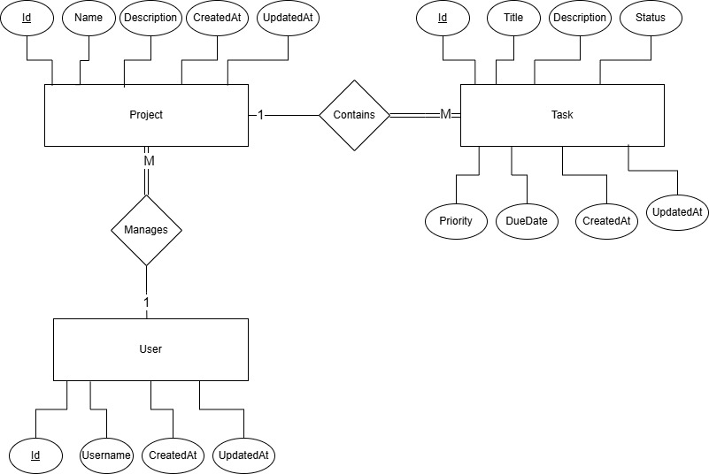
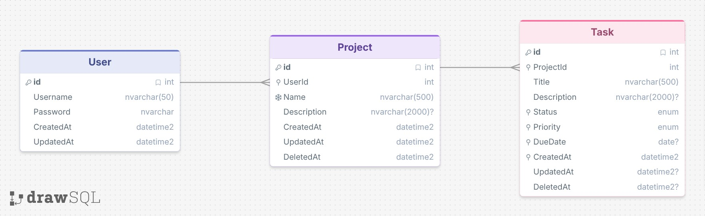

# Task Management

Project is built with **C# / ASP.NET Core 10** and **SQL Server**.

## Table of Contents

- [Features & Bonus Implemented](#features--bonus-implemented)
- [Setup](#setup)
- [API Documentation](#api-documentation)
- [Schema Design](#schema-design)
- [Testing](#testing)

## Features & Bonus Implemented

- Full CRUD for **Projects** and **Tasks**
- Simple JWT-based authentication — users can only see and manage their own projects and tasks *(bonus)*
- Soft deletes (`DeletedAt`) instead of hard deletes for projects and tasks *(bonus)*
- Cascade delete: removing a project removes its tasks
- Filtering (status, priority, due date range), sorting (due date, priority, created date), pagination, and case-insensitive search across task title/description
- Validation at both the API layer and the database layer (unique project names, required fields, foreign key checks)
- Result Pattern (`Result<T>`) for predictable business error handling instead of exceptions for expected failures
- Consistent `ProblemDetails` error responses
- APIs documented using **Swagger / OpenAPI**, with an interactive interface for exploring and testing endpoints
- Structured logging using Serilog with centralized log management through [Seq](https://datalust.co/seq) (Dockerized)
- EF Core migrations for schema management and a startup seeder for sample data *(bonus)*
- Unit tests (business logic) and integration tests (end-to-end HTTP flows against a real SQL Server database using Testcontainers)
- Dockerized: API + SQL Server + Seq all start with a single command using Docker Compose *(bonus)*
- Makefile with convenience commands for common development tasks such as running the application, rebuilding Docker containers, applying migrations, and executing tests *(bonus)*
  
## Setup

On startup, the database is seeded with a few sample users/projects/tasks (see `Persistence/DbSeeder.cs`) — this is idempotent, so it only runs once.

A test user is included in the seed data, so you can log in and try the API right away:

| Username   | Password |
|------------|----------|
| `testuser` | `12345`  |

**Seeded data for `testuser`:**

- 2 projects
- 5 tasks per project

### Option A — Docker (recommended, fastest way to start)

**Prerequisites:**

- [Docker](https://docs.docker.com/get-started/get-docker/)
- [Docker Compose](https://docs.docker.com/compose/install/)

```bash
git clone git@github.com:ammar-gamal/TaskManagement.git
cd TaskManagement
```

**Start containers:**

```bash
make docker-up
# or: docker-compose up --build
```

This starts three containers:

| Service   | Purpose                 | Exposed at             |
|-----------|--------------------------|-------------------------|
| `api`     | The Task Management API | <http://localhost:5130>   |
| `db`      | SQL Server 2025          | localhost:1433          |
| `logging` | Seq (log viewer)        | <http://localhost:5000>   |

Migrations and seed data run automatically on startup — there's nothing else to configure. Once the containers are healthy, open **<http://localhost:5130/swagger>** to explore and try the API.

### Option B — Run Locally with .NET

**Prerequisites:**

- [.NET 10 SDK](https://dotnet.microsoft.com/download)
- [SQL Server](https://www.microsoft.com/en-us/sql-server/sql-server-downloads)
- `dotnet-ef` tool: run `dotnet tool install --global dotnet-ef` (if not already installed)

```bash
git clone git@github.com:ammar-gamal/TaskManagement.git
cd TaskManagement
```

**1. Restore dependencies**

```bash
make restore
# or: dotnet restore
```

**2. Configure the database connection**

Edit `src/TaskManagement/appsettings.json` and configure the Database connection string to point to your SQL Server instance. By default, it is configured to connect to a local SQL Server using Windows Authentication:

```json
"ConnectionStrings": {
  "Database": "Server=.; Database=TaskManagementDb; Integrated Security=SSPI; TrustServerCertificate=True"
}
```

**3. Apply migrations**

```bash
make migrate
# or: dotnet ef database update --project src/TaskManagement/TaskManagement.csproj
```

`Database.Migrate()` is automatically called on startup (except the environment is `Testing`), so this step is useful if you want the schema ready before first launch.

**4. Run the app**

```bash
make run
# or: dotnet run --project src/TaskManagement/TaskManagement.csproj
```

Swagger UI is available at `http://localhost:5028/swagger`.

## API Documentation

**Tip:** It is highly recommended to use Swagger UI to explore, test, and interact with this API dynamically.

| Resource | Description |
|----------|-------------|
| [Authentication API](assets/docs/authentication.md) | User registration and login endpoints. |
| [Projects API](assets/docs/projects.md) | Project management and project-related task endpoints. |
| [Tasks API](assets/docs/tasks.md) | Task management, filtering, sorting, and pagination endpoints. |
| [Error Responses](assets/docs/errors.md) | Common API error response format and status codes. |

## Schema Design

**ERD**



**Schema**



## Design Choices

- **Enums stored as strings, not ints.** `Status` and `Priority` are persisted as
  readable strings instead of numeric values.

- **Soft deletes (`DeletedAt`).** Both `Projects` and `Tasks` use soft deletes,
  with EF Core global query filters (`HasQueryFilter`) automatically excluding
  deleted rows unless explicitly overridden.

- **Cascade delete foreign key.** The foreign key from `Tasks.ProjectId` to
  `Projects.Id` uses cascade delete. This acts as a safety net: if a project is
  ever hard-deleted directly in SQL, its related tasks are automatically removed
  instead of becoming orphaned records.

- **Indexes.**
  - **Projects Table**
    - **Unique filtered index on `Name`.** Enforces uniqueness only for active
      projects (`DeletedAt IS NULL`).
  - **Tasks Table**
    - **Filtered index on (`ProjectId`).** Indexes only active tasks
      (`DeletedAt IS NULL`), improving the performance of queries that retrieve
      a project's active tasks while keeping the index smaller than indexing all
      rows.
    - **Individual indexes on `Status`, `Priority`, `DueDate`, and `CreatedAt`.**
    Each column has its own index to optimize filtering and sorting operations.

## Testing

**Prerequisites:**

- [.NET 10 SDK](https://dotnet.microsoft.com/download)
- [Docker](https://docs.docker.com/get-started/get-docker/) (required for integration tests, as Testcontainers starts a real SQL Server container)
  
The solution has two test projects: `TaskManagement.UnitTests` and `TaskManagement.IntegrationTests`.

- **Unit tests** Unit tests cover application logic in isolation by mocking the dependencies of SUT(System Under Test). They verify task and project CRUD operations, business rule validations (such as due-date constraints), and entity-to-DTO mapping behavior.
- **Integration tests** spin up the real ASP.NET Core pipeline via `WebApplicationFactory`, it use a **real SQL Server container** (via Testcontainers) — no mocking of the database. They cover full HTTP flows including:
  - Create project → add task → mark task done → delete project (cascade)
  - Filtering tasks by status and priority
  - Searching tasks and verifying pagination

### Running Tests

From the solution root (the folder containing `TaskManagement.sln`):

```bash
make test
# or: dotnet test
```

Run only unit tests (no Docker required):

```bash
make test-unit
# or: dotnet test tests/TaskManagement.UnitTests
```

Run only integration tests (Docker required):

```bash
make test-integration
# or: dotnet test tests/TaskManagement.IntegrationTests
```
